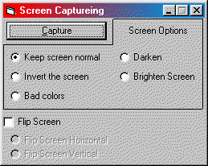



## More about screen capturing using BitBlt \(does more than just copy\) \*CHECK IT OUT\!\*

### Description

Ok... some other person made this code at first, but in his, it only copied the screen and showed you a little bit in a picturebox, mine captures the screen and shows it to you full screen and does more than just copy - it copys, inverts, makes screen have bad colors, darkens the screen, brightens the scree, flip the screen horizontal, and flip screen vertical so check it out!

First you choose how you want the scree captured then you press capture - the program captures the screen and then shows it to you until the user makes a mouse click.
 
### More Info
 
You input how you want the screen to be captured like

The code will show you the screen after capturing it using your input.

             |
---                |---
**Submitted On**   |2000-05-31 16:56:00
**By**             |[Ace315](https://github.com/Planet-Source-Code/PSCIndex/blob/master/ByAuthor/ace315.md)
**Level**          |Intermediate
**User Rating**    |5.0 (15 globes from 3 users)
**Compatibility**  |VB 4\.0 \(32\-bit\), VB 5\.0, VB 6\.0
**Category**       |[Miscellaneous](https://github.com/Planet-Source-Code/PSCIndex/blob/master/ByCategory/miscellaneous__1-1.md)
**World**          |[Visual Basic](https://github.com/Planet-Source-Code/PSCIndex/blob/master/ByWorld/visual-basic.md)
**Archive File**   |[CODE\_UPLOAD62655312000\.zip](https://github.com/Planet-Source-Code/ace315-more-about-screen-capturing-using-bitblt-does-more-than-just-copy-check-it-out__1-8496/archive/master.zip)

